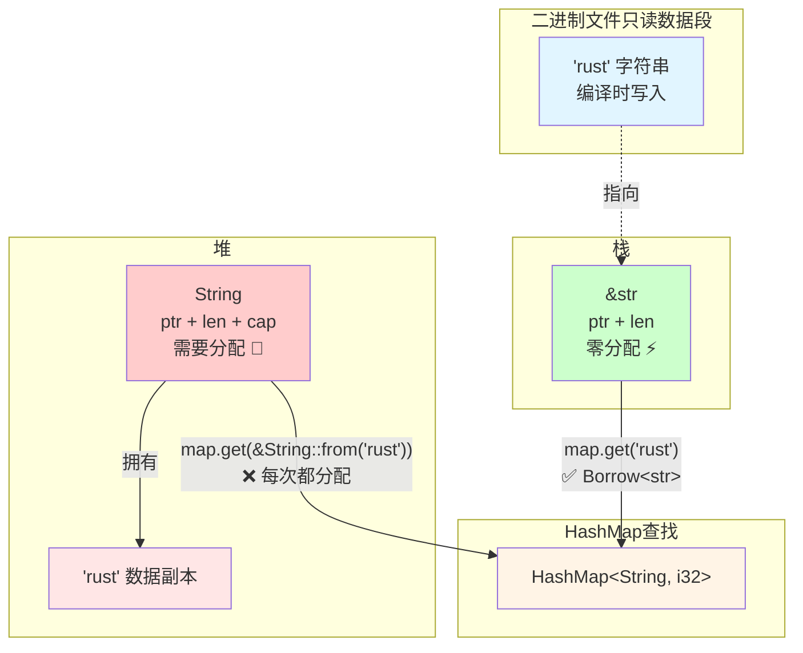

# Borrow：用 &str 查 String 键的秘密

简单说，`Borrow` trait 让你用「轻量级类型」查找「拥有所有权的类型」。最常见的场景：HashMap 用 `String` 做键，但查找时直接用 `&str`，不用每次都创建新的 `String`。



```rust
use std::collections::HashMap;

let mut map = HashMap::new();
map.insert(String::from("rust"), 42);

// ✅ 直接用 &str 查找，不分配内存
map.get("rust");  // 而不是 map.get(&String::from("rust"))
```

这就是 `Borrow` 的魔力：让 HashMap 查找更高效。

> **为什么叫 Borrow？**
>
> 这个名字来自 Rust 的核心概念「借用」。`String` 拥有数据的所有权，而 `&str` 是对这些数据的借用。`Borrow` trait 的语义就是：「我拥有这个数据（`String`），但你可以用借用形式（`&str`）来访问它」。
>
> 更深层的含义：`Borrow<T>` 表示「我可以被当作 `&T` 来使用」。比如 `String` 实现了 `Borrow<str>`，意思是「`String` 可以被当作 `&str` 来使用」。这和 Rust 的借用规则完美契合：你不需要拥有数据，只需要借用它就能完成工作。

## 1. 核心概念

### Borrow 是什么？

`Borrow<T>` 表示「我可以被当作 `&T` 来使用」。比如 `String` 实现了 `Borrow<str>`，意思是「`String` 可以被当作 `&str` 来使用」。

```rust
use std::borrow::Borrow;

let s = String::from("hello");
let borrowed: &str = s.borrow();  // String → &str
println!("{}", borrowed);  // "hello"
```

### 为什么需要 Borrow？

HashMap 的 `get` 方法需要它：

```rust
// HashMap::get 的签名
pub fn get<Q>(&self, k: &Q) -> Option<&V>
where
    K: Borrow<Q>,  // 键类型 K 必须能借用为 Q
    Q: Hash + Eq + ?Sized,
```

有了这个约束，你可以：

```rust
use std::collections::HashMap;

let mut map = HashMap::new();
map.insert(String::from("rust"), 42);  // 键是 String

// ✅ 用 &str 查找（因为 String: Borrow<str>）
map.get("rust");

// ✅ 用 String 查找（因为 String: Borrow<String>）
map.get(&String::from("rust"));
```

### Borrow vs AsRef

两个 trait 看起来很像，但有本质区别：

| 特性 | `Borrow<T>` | `AsRef<T>` |
| --- | --- | --- |
| **核心约束** | 哈希和比较必须一致 | 无特殊要求 |
| **典型用途** | HashMap/HashSet 键查找 | 函数参数灵活性 |
| **使用场景** | `map.get("key")` | `read_file(path)` |

**什么是「哈希和比较必须一致」？**

简单说：`hash(x) == hash(x.borrow())` 且 `x == x.borrow()`

这个约束保证 HashMap 能正确工作：

```rust
use std::collections::HashMap;

let mut map = HashMap::new();
map.insert(String::from("key"), 42);

// 插入时用 String 计算哈希，查找时用 &str 计算哈希
// 两个哈希值必须相同，否则找不到！
assert_eq!(map.get("key"), Some(&42));
```

详细原理见「底层原理」章节。

## 2. 底层原理

### Trait 定义

```rust
pub trait Borrow<Borrowed: ?Sized> {
    fn borrow(&self) -> &Borrowed;
}

pub trait BorrowMut<Borrowed: ?Sized>: Borrow<Borrowed> {
    fn borrow_mut(&mut self) -> &mut Borrowed;
}
```

### 核心约束：哈希一致性

这是 `Borrow` 最重要的规则：

> **如果 `x.borrow() == y.borrow()`，那么 `hash(x) == hash(y)`**

```rust
use std::collections::hash_map::DefaultHasher;
use std::hash::{Hash, Hasher};

fn calculate_hash<T: Hash>(t: &T) -> u64 {
    let mut hasher = DefaultHasher::new();
    t.hash(&mut hasher);
    hasher.finish()
}

fn main() {
    let s = String::from("hello");
    let str_ref: &str = "hello";
    
    // String 和 &str 的哈希值必须相同
    assert_eq!(calculate_hash(&s), calculate_hash(&str_ref));
    
    // 比较结果也必须相同
    assert_eq!(s, str_ref);
}
```

**为什么重要**？HashMap 依赖这个约束：

```rust
use std::collections::HashMap;

let mut map = HashMap::new();
map.insert(String::from("key"), 42);

// 插入时：用 String 计算哈希 → 存到某个桶
// 查找时：用 &str 计算哈希 → 必须找到同一个桶
// 如果哈希不同，就找不到了！
assert_eq!(map.get("key"), Some(&42));
```

### 标准库实现

```rust
// String 实现 Borrow<str>
impl Borrow<str> for String {
    fn borrow(&self) -> &str {
        &self[..]
    }
}

// Vec<T> 实现 Borrow<[T]>
impl<T> Borrow<[T]> for Vec<T> {
    fn borrow(&self) -> &[T] {
        &self[..]
    }
}

// 所有类型都实现 Borrow<Self>（自反性）
impl<T: ?Sized> Borrow<T> for T {
    fn borrow(&self) -> &T {
        self
    }
}
```

## 3. 使用场景

### 场景 1：HashMap 用 String 键，&str 查找

```rust
use std::collections::HashMap;

fn main() {
    let mut scores = HashMap::new();
    scores.insert(String::from("Alice"), 95);
    scores.insert(String::from("Bob"), 87);
    
    // ✅ 直接用 &str 查找，零分配
    println!("Alice: {:?}", scores.get("Alice"));
    
    // ✅ 也可以用 String 查找
    let name = String::from("Bob");
    println!("Bob: {:?}", scores.get(&name));
}
```

### 场景 2：HashSet 用 Vec 键，切片查找

```rust
use std::collections::HashSet;

fn main() {
    let mut set = HashSet::new();
    set.insert(vec![1, 2, 3]);
    set.insert(vec![4, 5, 6]);
    
    // ✅ 用切片查找，不创建 Vec
    println!("Contains [1,2,3]: {}", set.contains(&[1, 2, 3][..]));
}
```

### 场景 3：自定义类型实现 Borrow

```rust
use std::borrow::Borrow;
use std::collections::HashMap;

// 用户 ID（拥有所有权）
#[derive(Debug, Clone, PartialEq, Eq, Hash)]
struct UserId(String);

// UserId 可以借用为 str
impl Borrow<str> for UserId {
    fn borrow(&self) -> &str {
        &self.0
    }
}

fn main() {
    let mut users = HashMap::new();
    users.insert(UserId(String::from("alice")), "Alice");
    users.insert(UserId(String::from("bob")), "Bob");
    
    // ✅ 用 &str 查找 UserId 键
    println!("User: {:?}", users.get("alice"));
}
```

## 4. 常见陷阱

### 陷阱 1：违反哈希一致性

```rust
use std::borrow::Borrow;
use std::hash::{Hash, Hasher};

struct BadType(String);

// ❌ 错误！哈希实现不一致
impl Hash for BadType {
    fn hash<H: Hasher>(&self, state: &mut H) {
        self.0.to_uppercase().hash(state);  // 转大写后哈希
    }
}

impl Borrow<str> for BadType {
    fn borrow(&self) -> &str {
        &self.0  // 返回原始字符串
    }
}

// 问题：BadType("hello") 和 "hello" 的哈希值不同！
// 在 HashMap 中会导致查找失败
```

**正确做法**：

```rust
impl Hash for BadType {
    fn hash<H: Hasher>(&self, state: &mut H) {
        self.0.hash(state);  // 和 str 的哈希一致
    }
}
```

### 陷阱 2：混淆 Borrow 和 AsRef

```rust
use std::path::{Path, PathBuf};

// ✅ 函数参数：用 AsRef
fn read_file<P: AsRef<Path>>(path: P) -> std::io::Result<String> {
    std::fs::read_to_string(path.as_ref())
}

// ✅ HashMap 键查找：用 Borrow
use std::collections::HashMap;
let mut map: HashMap<PathBuf, i32> = HashMap::new();
map.insert(PathBuf::from("/tmp/file"), 42);
map.get(Path::new("/tmp/file"));  // 依赖 Borrow<Path>
```

**记住**：

- 函数参数灵活性 → `AsRef`
- HashMap/HashSet 键查找 → `Borrow`

### 陷阱 3：BorrowMut 用得很少

```rust
use std::borrow::BorrowMut;

fn modify_slice<T: BorrowMut<[i32]>>(mut data: T) {
    let slice = data.borrow_mut();
    slice[0] = 99;
}

fn main() {
    let mut vec = vec![1, 2, 3];
    modify_slice(&mut vec);
    println!("{:?}", vec);  // [99, 2, 3]
}
```

**实际上**：大多数情况直接用 `&mut [T]` 更简单，不需要 `BorrowMut`。

## 5. 最佳实践

### 1. HashMap/HashSet 的键类型

```rust
use std::collections::HashMap;

// ✅ 标准做法：拥有所有权的键
let mut map: HashMap<String, i32> = HashMap::new();
map.insert(String::from("key"), 42);

// ✅ 查找时用借用形式
map.get("key");  // &str
map.contains_key("key");
map.remove("key");
```

### 2. 自定义类型实现 Borrow

只在以下情况实现：

1. 你的类型会作为 HashMap/HashSet 的键
2. 你想用更轻量的类型查找

```rust
use std::borrow::Borrow;

#[derive(Debug, Clone, PartialEq, Eq, Hash)]
struct Email(String);

impl Borrow<str> for Email {
    fn borrow(&self) -> &str {
        &self.0
    }
}

// 现在可以用 &str 查找 Email 键
use std::collections::HashMap;
let mut emails: HashMap<Email, String> = HashMap::new();
emails.insert(Email(String::from("alice@example.com")), String::from("Alice"));
emails.get("alice@example.com");  // ✅
```

### 3. 不要过度使用

```rust
// ❌ 没必要
fn process<T: Borrow<str>>(s: T) {
    println!("{}", s.borrow());
}

// ✅ 直接用 AsRef 或 &str
fn process<S: AsRef<str>>(s: S) {
    println!("{}", s.as_ref());
}

// ✅ 更简单
fn process(s: &str) {
    println!("{}", s);
}
```

**原则**：只在 HashMap/HashSet 场景用 `Borrow`，其他情况用 `AsRef` 或具体类型。

### 4. 文档说明哈希一致性

如果你实现了 `Borrow`，在文档里说明：

```rust
/// 用户 ID
///
/// # Borrow 实现
/// `UserId` 实现了 `Borrow<str>`，保证：
/// - `UserId("alice")` 和 `"alice"` 的哈希值相同
/// - `UserId("alice") == "alice"` 返回 true
///
/// 这允许在 HashMap 中用 `&str` 查找 `UserId` 键。
#[derive(Debug, Clone, PartialEq, Eq, Hash)]
struct UserId(String);
```

## 总结

1. **Borrow 是 HashMap 的秘密武器**：让你用 `&str` 查找 `String` 键，避免分配
2. **核心约束**：`hash(x) == hash(x.borrow())` 且 `x == x.borrow()`
3. **使用场景**：HashMap/HashSet 键查找，其他场景用 `AsRef`

**记住**：

- HashMap 键查找 → `Borrow`
- 函数参数灵活性 → `AsRef`
- 简单场景 → 直接用具体类型

下次写 HashMap 代码时，想想：「能不能用更轻量的类型查找？」如果答案是「能」，`Borrow` 就是你的朋友。
