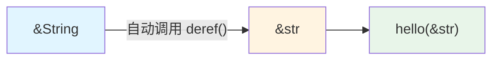
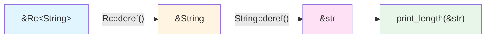

# Deref 与 DerefMut

你有没有想过，为什么 `String` 能直接传给接受 `&str` 的函数？为什么 `Box<T>` 能像普通值一样调用方法？

```rust
fn print_text(s: &str) {
    println!("{}", s);
}

let my_string = String::from("hello");
print_text(&my_string);  // 为什么 &String 能传给 &str？
```

答案就是 `Deref` trait。它做了两件事：

1. **让你的类型支持 `*` 解引用**：`*boxed` 能拿到 Box 里的值
2. **自动类型转换**：`&String` 自动变成 `&str`，`&Vec<T>` 自动变成 `&[T]`

第二点才是 `Deref` 的杀手锏——你写 API 时只需要接受 `&str`，调用者传 `String`、`&str`、`Box<str>` 都行，Rust 会自动帮你转换。

## 1. 核心概念

### Deref 到底是什么？

先看一个最简单的例子：

```rust
let x = 5;
let r = &x;      // r 是引用
let y = *r;      // *r 解引用，拿到 5
```

引用天生支持 `*` 解引用。但如果你自己写了个智能指针类型，怎么让它也能用 `*`？

```rust
struct MyBox<T>(T);

let boxed = MyBox(5);
let value = *boxed;  // 错误！MyBox 不支持 *
```

这就是 `Deref` trait 的第一个作用：**让自定义类型支持 `*` 运算符**。

```rust
use std::ops::Deref;

impl<T> Deref for MyBox<T> {
    type Target = T;  // 解引用后得到什么类型
    
    fn deref(&self) -> &T {
        &self.0  // 返回内部值的引用
    }
}

let boxed = MyBox(5);
let value = *boxed;  // 现在可以了！等价于 *(boxed.deref())
```

**关键理解**：`*boxed` 不是直接拿到值，而是：
1. 调用 `boxed.deref()` 得到 `&T`
2. 再对这个引用解引用，得到 `T`

所以 `*boxed` 实际上是 `*(boxed.deref())` 的语法糖。

### Deref 的真正威力：自动类型转换

但 `Deref` 最牛的地方不是 `*` 运算符，而是**解引用强制转换**（deref coercion）。

看这个例子：

```rust
fn print_length(s: &str) {
    println!("长度: {}", s.len());
}

let my_string = String::from("hello");
print_length(&my_string);  // &String 自动转为 &str！
```

为什么 `&String` 能传给接受 `&str` 的函数？因为 `String` 实现了 `Deref<Target=str>`：

```rust
impl Deref for String {
    type Target = str;
    fn deref(&self) -> &str {
        // 返回内部字符串切片
    }
}
```

当你写 `print_length(&my_string)` 时，Rust 发现：
- 你传的是 `&String`
- 函数要的是 `&str`
- `String` 实现了 `Deref<Target=str>`

于是 Rust 自动调用 `my_string.deref()`，把 `&String` 转成 `&str`。

**这才是 Deref 的核心价值**：让你的 API 更灵活。你只需要写：

```rust
fn process(s: &str) { /* ... */ }
```

调用者可以传：
- `&str` 字面量：`process("hello")`
- `String`：`process(&my_string)`
- `Box<str>`：`process(&boxed_str)`
- `Rc<String>`：`process(&rc_string)`

Rust 会自动帮你转换，不需要手动调用 `.as_str()` 或 `.deref()`。

### DerefMut：可变版本

`DerefMut` 是 `Deref` 的可变版本，让你能修改智能指针里的值：

```rust
use std::ops::{Deref, DerefMut};

impl<T> DerefMut for MyBox<T> {
    fn deref_mut(&mut self) -> &mut T {
        &mut self.0
    }
}

let mut boxed = MyBox(String::from("hello"));
boxed.push_str(" world");  // 自动调用 deref_mut()，然后调用 String::push_str
```

**规则**：
- 实现 `DerefMut` 必须先实现 `Deref`
- `&mut T` 可以自动转为 `&mut U`（如果 `T: DerefMut<Target=U>`）
- `&mut T` 也可以转为 `&U`（可变引用可以降级为不可变引用）
- 但 `&T` **不能**转为 `&mut U`（不可变引用不能升级为可变引用）

### 完整示例

```rust
use std::ops::{Deref, DerefMut};

struct MyBox<T>(T);

impl<T> Deref for MyBox<T> {
    type Target = T;
    fn deref(&self) -> &T {
        &self.0
    }
}

impl<T> DerefMut for MyBox<T> {
    fn deref_mut(&mut self) -> &mut T {
        &mut self.0
    }
}

fn main() {
    let mut boxed = MyBox(String::from("hello"));
    
    // 使用 * 解引用
    println!("{}", *boxed);  // 输出: hello
    
    // 自动调用 String 的方法（通过 deref）
    println!("长度: {}", boxed.len());
    
    // 自动调用 String 的可变方法（通过 deref_mut）
    boxed.push_str(" world");
    println!("{}", *boxed);  // 输出: hello world
}
```

## 2. 解引用强制转换（Deref Coercion）⭐

> **💡 这是 Deref 最重要的特性！** 如果只能记住一个知识点，就记住这个。

这是 `Deref` 最强大的特性：Rust 会自动插入 `deref` 调用，让类型转换无缝进行。

### 自动转换规则

当你传递 `&T` 给期望 `&U` 的函数时，如果 `T: Deref<Target=U>`，Rust 会自动转换：

```rust
fn hello(name: &str) {
    println!("Hello, {}", name);
}

fn main() {
    let s = String::from("Rust");
    hello(&s);  // &String 自动转换为 &str
    
    // 等价于：
    // hello(s.deref());  // String 实现了 Deref<Target=str>
}
```



### 多层解引用

Rust 会递归调用 `deref`，直到找到匹配的类型：

```rust
use std::rc::Rc;

fn print_length(s: &str) {
    println!("长度: {}", s.len());
}

fn main() {
    let s = Rc::new(String::from("hello"));
    print_length(&s);  // &Rc<String> -> &String -> &str
}
```



### 三种强制转换规则

| 从 | 到 | 条件 |
| --- | --- | --- |
| `&T` | `&U` | `T: Deref<Target=U>` |
| `&mut T` | `&mut U` | `T: DerefMut<Target=U>` |
| `&mut T` | `&U` | `T: Deref<Target=U>` |

注意：**不能**从 `&T` 转换为 `&mut U`（违反借用规则）。

```rust
fn main() {
    let mut s = String::from("hello");
    
    // ✅ &mut String -> &str（可变转不可变）
    let r: &str = &mut s;
    
    // ❌ &String -> &mut str（不可变转可变，编译错误）
    // let r: &mut str = &s;
}
```

## 3. 标准库中的 Deref 实现

### String -> str

```rust
impl Deref for String {
    type Target = str;
    fn deref(&self) -> &str {
        // 返回内部字节切片的 str 引用
    }
}
```

这让你能把 `&String` 传给接受 `&str` 的函数：

```rust
fn count_chars(s: &str) -> usize {
    s.chars().count()
}

let s = String::from("你好");
count_chars(&s);  // &String 自动转为 &str
```

### Vec<T> -> [T]

```rust
impl<T> Deref for Vec<T> {
    type Target = [T];
    fn deref(&self) -> &[T] {
        // 返回内部数组的切片
    }
}
```

```rust
fn sum(slice: &[i32]) -> i32 {
    slice.iter().sum()
}

let v = vec![1, 2, 3];
sum(&v);  // &Vec<i32> 自动转为 &[i32]
```

### Box<T> -> T

```rust
impl<T: ?Sized> Deref for Box<T> {
    type Target = T;
    fn deref(&self) -> &T {
        // 返回堆上值的引用
    }
}
```

```rust
let boxed = Box::new(String::from("hello"));
let len = boxed.len();  // 直接调用 String 的方法
```

### Rc<T> / Arc<T> -> T

```rust
use std::rc::Rc;

let shared = Rc::new(vec![1, 2, 3]);
let first = shared[0];  // Rc<Vec<T>> 自动解引用为 Vec<T>
```

## 4. 实现自己的智能指针

核心就三步：

1. **定义结构体**：包装你要管理的数据
2. **实现 Deref**：返回内部数据的引用
3. **实现 DerefMut**（可选）：返回内部数据的可变引用

### 最简单的例子

```rust
use std::ops::{Deref, DerefMut};

// 1. 定义智能指针
struct MyBox<T>(T);

// 2. 实现 Deref
impl<T> Deref for MyBox<T> {
    type Target = T;  // 解引用后得到什么类型
    
    fn deref(&self) -> &T {
        &self.0  // 返回内部值的引用
    }
}

// 3. 实现 DerefMut（如果需要修改）
impl<T> DerefMut for MyBox<T> {
    fn deref_mut(&mut self) -> &mut T {
        &mut self.0  // 返回内部值的可变引用
    }
}

// 现在可以像普通值一样使用了！
fn main() {
    let mut boxed = MyBox(String::from("hello"));
    
    println!("{}", *boxed);  // 解引用：hello
    println!("{}", boxed.len());  // 自动调用 String::len()
    
    boxed.push_str(" world");  // 自动调用 String::push_str()
    println!("{}", *boxed);  // hello world
}
```

### 为什么要自己实现？

实现 Deref 可以让你的类型：

1. **像普通值一样使用**：调用内部类型的方法
2. **自动类型转换**：传给接受引用的函数
3. **添加额外功能**：在不改变使用方式的前提下增强功能

```rust
use std::ops::Deref;

// 例子：带日志的智能指针
struct Logged<T> {
    value: T,
    access_count: std::cell::Cell<usize>,  // 记录访问次数
}

impl<T> Logged<T> {
    fn new(value: T) -> Self {
        println!("创建 Logged 包装");
        Logged {
            value,
            access_count: std::cell::Cell::new(0),
        }
    }
    
    fn access_count(&self) -> usize {
        self.access_count.get()
    }
}

impl<T> Deref for Logged<T> {
    type Target = T;
    
    fn deref(&self) -> &T {
        // 每次访问都记录
        let count = self.access_count.get();
        self.access_count.set(count + 1);
        println!("访问第 {} 次", count + 1);
        &self.value
    }
}

fn main() {
    let logged = Logged::new(String::from("hello"));
    
    // 像普通 String 一样使用，但每次访问都有日志
    println!("长度: {}", logged.len());  // 访问第 1 次
    println!("大写: {}", logged.to_uppercase());  // 访问第 2 次
    
    println!("总共访问了 {} 次", logged.access_count());
}
```

**关键点**：通过 Deref，`Logged<String>` 可以像 `String` 一样调用 `.len()`、`.to_uppercase()` 等方法，同时还能记录访问次数。用户不需要写 `logged.value.len()`，代码更简洁。

**关键点**：

- `deref()` 必须返回引用，不能返回临时值
- 实现 `DerefMut` 必须先实现 `Deref`
- 不要用 `Deref` 模拟继承，只用于智能指针

## 5. 使用场景

| 场景 | 说明 |
| --- | --- |
| 智能指针 | `Box`、`Rc`、`Arc` 等需要像普通引用一样使用 |
| 包装类型 | 为类型添加额外功能（如缓存、日志）但保持透明访问 |
| 类型转换 | `String` -> `str`、`Vec<T>` -> `[T]` 等自动转换 |
| API 设计 | 让函数接受 `&str` 而非 `&String`，更灵活 |

### API 设计最佳实践

```rust
// ❌ 不好：强制调用者传 String
fn process_bad(s: &String) {
    println!("{}", s);
}

// ✅ 好：接受 &str，String 和 &str 都能传
fn process_good(s: &str) {
    println!("{}", s);
}

fn main() {
    let owned = String::from("hello");
    let borrowed = "world";
    
    // process_bad(&borrowed);  // 错误！&str 不能转为 &String
    process_bad(&owned);        // 只能传 String
    
    process_good(&owned);       // &String 自动转为 &str
    process_good(borrowed);     // &str 直接传入
}
```

**原则**：函数参数优先用 `&str`、`&[T]` 等切片类型，而非 `&String`、`&Vec<T>`。

## 6. 常见陷阱

### 陷阱 1：过度使用 Deref

`Deref` 不是继承！不要用它来模拟面向对象的继承关系。

```rust
// ❌ 错误示例：用 Deref 模拟继承
struct Employee {
    name: String,
}

struct Manager {
    employee: Employee,
    team_size: usize,
}

impl Deref for Manager {
    type Target = Employee;
    fn deref(&self) -> &Employee {
        &self.employee
    }
}

// 这不是继承！Manager 不是 Employee 的子类
```

**正确做法**：用组合（composition）或 trait。

```rust
trait Person {
    fn name(&self) -> &str;
}

impl Person for Employee {
    fn name(&self) -> &str {
        &self.name
    }
}

impl Person for Manager {
    fn name(&self) -> &str {
        &self.employee.name
    }
}
```

### 陷阱 2：Deref 返回临时值

`deref` 必须返回引用，不能返回临时值：

```rust
struct Wrapper(i32);

impl Deref for Wrapper {
    type Target = i32;
    
    fn deref(&self) -> &i32 {
        // ❌ 错误！返回临时值的引用
        // &(self.0 + 1)  // 临时值在函数结束时销毁
        
        // ✅ 正确：返回字段的引用
        &self.0
    }
}
```

### 陷阱 3：混淆 Deref 和 AsRef

| Trait | 用途 | 自动转换 |
| --- | --- | --- |
| `Deref` | 智能指针行为 | 是（函数参数、方法调用） |
| `AsRef` | 廉价引用转换 | 否（需要显式调用 `.as_ref()`） |

```rust
fn with_deref(s: &str) {
    // &String 自动转换
}

fn with_asref<T: AsRef<str>>(s: T) {
    let s_ref: &str = s.as_ref();  // 需要显式调用
}

let s = String::from("hello");
with_deref(&s);      // 自动转换
with_asref(&s);      // 泛型约束，内部需要 as_ref()
```

**选择建议**：

- 智能指针用 `Deref`
- 泛型函数接受多种类型用 `AsRef`

### 陷阱 4：DerefMut 的借用冲突

```rust
use std::ops::{Deref, DerefMut};

struct Wrapper(String);

impl Deref for Wrapper {
    type Target = String;
    fn deref(&self) -> &String {
        &self.0
    }
}

impl DerefMut for Wrapper {
    fn deref_mut(&mut self) -> &mut String {
        &mut self.0
    }
}

fn main() {
    let mut w = Wrapper(String::from("hello"));
    
    // ❌ 错误！同时存在可变和不可变引用
    // let r1 = &w;
    // let r2 = &mut w;
    
    // ✅ 正确：分开使用
    {
        let r = &w;
        println!("{}", r.len());
    }
    {
        let r = &mut w;
        r.push_str(" world");
    }
}
```

## 7. 最佳实践

### 1. 只为智能指针实现 Deref

`Deref` 的设计初衷是让智能指针表现得像引用。如果你的类型不是智能指针，可能不应该实现 `Deref`。

```rust
// ✅ 合适：智能指针
struct MyBox<T>(T);
impl<T> Deref for MyBox<T> { /* ... */ }

// ❌ 不合适：普通结构体
struct User { name: String }
impl Deref for User {  // 不要这样做！
    type Target = String;
    fn deref(&self) -> &String { &self.name }
}
```

### 2. Target 类型应该是「内部数据」

`Deref` 应该暴露智能指针内部持有的数据，而不是计算出的新值。

```rust
// ✅ 好：暴露内部数据
impl Deref for Box<T> {
    type Target = T;
    fn deref(&self) -> &T { /* 返回堆上的 T */ }
}

// ❌ 不好：返回计算值
impl Deref for Vec<i32> {
    type Target = i32;
    fn deref(&self) -> &i32 {
        &self.iter().sum()  // 这不是 Deref 的用途！
    }
}
```

### 3. 函数参数用切片类型

利用 Deref coercion，让 API 更灵活：

```rust
// ✅ 推荐
fn process(s: &str) { /* ... */ }
fn sum(slice: &[i32]) -> i32 { /* ... */ }

// ❌ 不推荐
fn process(s: &String) { /* ... */ }
fn sum(vec: &Vec<i32>) -> i32 { /* ... */ }
```

### 4. 文档说明 Deref 行为

如果你的类型实现了 `Deref`，在文档中说明：

```rust
/// 智能指针，持有堆上的 T。
/// 
/// 实现了 `Deref<Target=T>`，可以像 `&T` 一样使用。
/// 
/// # 示例
/// 
/// ```
/// let boxed = MyBox::new(5);
/// assert_eq!(5, *boxed);  // 解引用
/// ```
pub struct MyBox<T>(T);
```

## 总结

1. **Deref 让类型支持 `*` 解引用**：返回内部数据的引用
2. **解引用强制转换是核心特性**：`&String` 自动转为 `&str`，让 API 更灵活
3. **只为智能指针实现 Deref**：不要滥用它来模拟继承
4. **函数参数用切片类型**：`&str` 而非 `&String`，`&[T]` 而非 `&Vec<T>`
